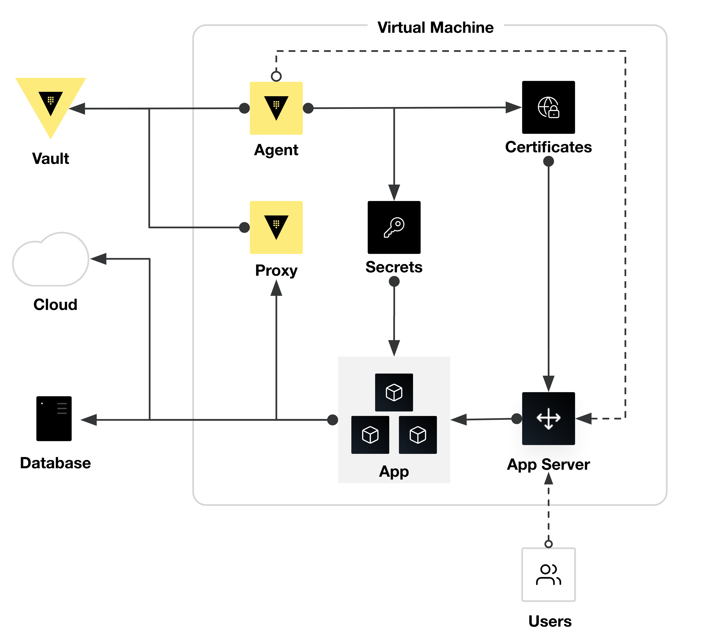

# Preforking Python Web Application

## Overview
A VM based Python web application leveraging a preforking model with Vault integration via Vault Agent/Proxy.

Features:
- AppRole Auth
- Static Secrets (KV-V2)
- Dynamic Secrets (AWS, Database, PKI,)
- Encryption as a Service (Transit/Transform)
- Tools (Random Bytes)
- Vault Agent
- Vault Proxy


## Diagram
<p align="center">
    
</p>


## Demo Environment
Navigate to the [demo](https://github.com/michaelkosir/vault-python-webapp/tree/main/demo) folder for a guide on setting up a full-fledged demo environment.


## Local Development
Run `make dev` after cloning to setup virtual environment, dotenv files, docker containers, and launch a develpoment fastapi server.
```shell
$ git clone ...
$ cd ...
$ make dev

# view all commands by running `make` or `make help`
$ make

  help       Show this help message
  venv       Setup Python virtual environment
  env        Setup dotenv files for local testing
  setup      Setup Docker containers
  dev        Launch a dev server
  stop       Stop dev server and containers
```
